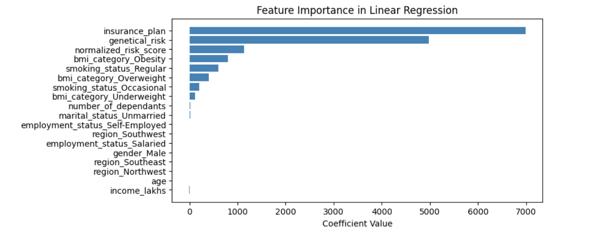

# Healthcare Premium Loan Prediction

## Description

In today’s world, healthcare costs are rising, and securing the right premium loan can be daunting. The Healthcare Premium Loan Prediction App simplifies this process by harnessing the power of machine learning and data-driven insights.The Healthcare Premium Loan Prediction App leverages machine learning to provide instant predictions on healthcare premium loans based on personal details like age, income, medical history, and more.

## Features:
* Interactive User Interface: A simple and intuitive UI for users to input details.
* Real-Time Prediction: Instantly predicts the healthcare premium loan eligibility based on the input.
* Model Customization: Two separate machine learning models used based on the age group of the individual (young or rest).
* Data Preprocessing: Real-time scaling and one-hot encoding for the input data.
* Medical Risk Calculation: Integrated medical history-based risk scoring system.
  
## Technology Stack
* Pandas: For data handling and manipulation.
* Scikit-learn: Used for machine learning model training, scaling, and preprocessing.
* Joblib: For saving and loading the trained models and scalers.
* Python: Core language for the backend processing.
* Streamlit: For building the web application and user interface.

## Models
### Young Model (Age ≤ 25)
This model is designed for individuals aged 25 and below. It uses machine learning to predict healthcare premium loans based on input features like age, income, medical history, and more.
#### Feature Importance (Young Model)
The feature importance graph below shows which features contribute the most to predictions for individuals aged 25 and below.

